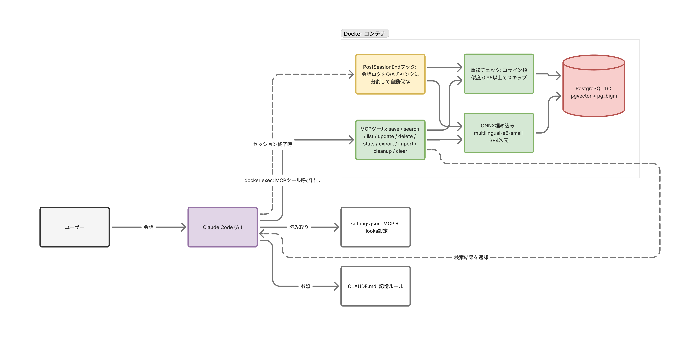
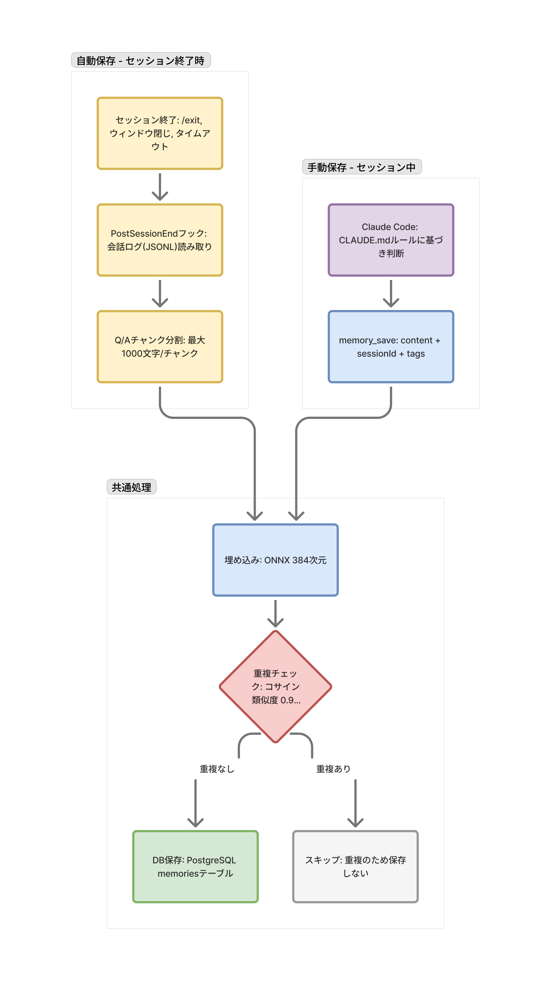
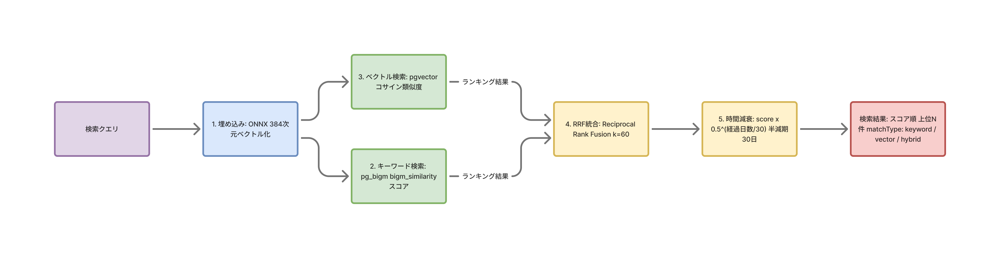

# claude-memory

Claude Code のセッションを跨いだ長期記憶システム。

## 課題

Claude Code は強力な開発パートナーだが、**セッションが終わると全てを忘れる**。

- 先週決めた設計判断を今日また1から説明する
- 同じバグの原因を何度も調査する
- ユーザーの好み（コードスタイル、レビュー観点）を毎回伝え直す

Claude Code の公式 Memory（CLAUDE.md + auto memory）はファイルベースのテキスト保存であり、記憶が増えるほど関連する情報を見つけにくくなる。

## 解決

claude-memory は **セッションを跨いだ長期記憶** をハイブリッド検索で提供する。

| 公式 Memory | claude-memory |
|-------------|---------------|
| ファイルベース | PostgreSQL + ベクトルDB |
| テキスト検索のみ | キーワード検索（pg_bigm）+ ベクトル類似度検索（pgvector）のハイブリッド |
| 手動管理 | セッション終了時に自動保存 + 重複自動排除 |
| フラットなテキスト | タグ・プロジェクトスコープで構造化 |
| 時間の概念なし | 時間減衰で新しい記憶を優先 |
| エクスポート不可 | JSON エクスポート/インポート対応 |

## 特徴

- **ローカル完結** — 外部APIへの送信なし。埋め込みモデルもDBもDockerコンテナ内で動作
- **ハイブリッド検索** — キーワード検索 + ベクトル類似度をRRFで統合し、時間減衰で新しい記憶を優先
- **自動記憶** — セッション終了時に会話をQ&Aペアに分割して自動保存
- **重複排除** — コサイン類似度 >= 0.95 の記憶は自動スキップ
- **多言語対応** — 日本語・英語どちらでも検索可能

## 全体像



## セットアップ

### 前提条件

- Docker / Docker Compose
- Claude Code（CLI / デスクトップ / IDE拡張）

### 1. 起動

```bash
git clone https://github.com/hiromiogawa/claude-memory.git
cd claude-memory
docker compose up -d
```

このコマンドで PostgreSQL と MCP Server の両コンテナが起動する。

> **MCP Server のプロセスライフサイクル:**
> MCP Server は常駐デーモンではない。Claude Code がセッションを開始すると `docker exec` で Node.js プロセスが1つ起動し、stdio（標準入出力）で通信する。セッション中はそのプロセスが維持され、複数のツール呼び出しを処理する。セッション終了時に stdin が閉じられるとプロセスも自動終了する。並行して複数プロセスが起動することはなく、リソース消費は最小限。

起動確認：

```bash
docker compose ps
# db         ... healthy
# mcp-server ... running
```

### 2. Claude Code の設定（MCP + Hooks）

`~/.claude/settings.json`（グローバル設定）に以下を追加：

```json
{
  "mcpServers": {
    "claude-memory": {
      "command": "docker",
      "args": [
        "exec",
        "claude-memory-mcp-server-1",
        "node",
        "packages/mcp-server/dist/index.js"
      ]
    }
  },
  "hooks": {
    "SessionStart": [
      {
        "command": "docker exec claude-memory-mcp-server-1 node packages/mcp-server/dist/session-start.js"
      }
    ],
    "PostSessionEnd": [
      {
        "command": "docker exec claude-memory-mcp-server-1 node packages/hooks/dist/index.js"
      }
    ]
  }
}
```

**設定ファイルの場所:**

| ファイル | スコープ | 用途 |
|---------|---------|------|
| `~/.claude/settings.json` | グローバル | 全プロジェクトで使う場合 |
| `<project>/.claude/settings.json` | プロジェクト | 特定プロジェクトのみで使う場合 |

**この設定で有効になること:**

- **mcpServers** — Claude Code が `memory_save`, `memory_search` 等のMCPツールを使えるようになる
- **hooks.PostSessionEnd** — セッション終了時に会話内容をQ&Aペアに分割してDBに自動保存する。ユーザーが意識する必要はなく、会話を終了するだけで記憶が蓄積される

設定後、Claude Code を再起動すると反映される。

### 3. 記憶ルールの設定

Claude Code が記憶をいつ・何を・どう保存/検索するかのルールを設定する。2つの方法がある。

#### 方法A: スキルを使う（推奨）

`.claude/skills/memory-usage/` ディレクトリをプロジェクトにコピーする：

```bash
cp -r <claude-memory-repo>/.claude/skills/memory-usage <your-project>/.claude/skills/
```

CLAUDE.md にスキル名を記載する：

```markdown
## Skills
- memory-usage → 記憶の保存・検索・活用ルール
```

スキルには以下が含まれる：

- セッション開始時の検索手順
- 保存する情報/しない情報の判断基準
- scope（project/global）の使い分け
- タグ体系と検索戦略
- 重複・矛盾する記憶の扱い
- ADR連携フロー

#### 方法B: CLAUDE.md に直接記載

スキルを使わずシンプルに始めたい場合は、CLAUDE.md に記憶ルールを直接書く：

```markdown
## 記憶ルール
- セッション開始時に memory_search で関連する記憶を検索する
- 重要な設計判断、バグ原因、ユーザーの好みを memory_save で保存する
- 一般的な技術知識は保存しない
- 保存時は tags を付けて検索しやすくする
```

## 記憶の保存と検索

### 保存フロー



| タイミング | トリガー | source |
|-----------|---------|--------|
| セッション中 | Claude Code が `memory_save` を呼ぶ | `manual` |
| セッション終了時 | PostSessionEnd フックが自動実行 | `auto` |

### 検索パイプライン



## MCPツール一覧

| ツール | 説明 | 主な引数 |
|--------|------|---------|
| `memory_save` | 記憶を保存 | `content`, `sessionId`, `tags?` |
| `memory_search` | ハイブリッド検索 | `query`, `limit?`, `projectPath?`, `tags?`, `allProjects?` |
| `memory_list` | 一覧取得 | `limit?`, `offset?`, `source?`, `tags?` |
| `memory_update` | 記憶を更新 | `id`, `content?`, `tags?` |
| `memory_delete` | 記憶を削除 | `id` |
| `memory_export` | 全記憶をJSONエクスポート | なし |
| `memory_import` | JSONからインポート | `data` |
| `memory_cleanup` | 古い記憶を削除 | `olderThanDays`, `dryRun?` |
| `memory_stats` | 統計情報 | なし |
| `memory_clear` | 全記憶を削除 | なし |

各ツールの詳細な引数・戻り値は [MCPツールリファレンス](docs/engineer/mcp-tools.md) を参照。

## 環境変数

| 変数 | デフォルト | 説明 |
|------|----------|------|
| `DATABASE_URL` | （必須） | PostgreSQL接続URL |
| `EMBEDDING_MODEL` | `intfloat/multilingual-e5-small` | 埋め込みモデル名 |
| `EMBEDDING_DIMENSION` | `384` | 埋め込み次元数 |
| `DB_POOL_SIZE` | `10` | DBコネクションプールサイズ |
| `LOG_LEVEL` | `info` | ログレベル |

## 開発者向けドキュメント

| ドキュメント | 内容 |
|-------------|------|
| [アーキテクチャ](docs/engineer/architecture.md) | クリーンアーキテクチャ、パッケージ構成、依存方向 |
| [技術選定](docs/engineer/tech-decisions.md) | 各技術の選定理由と代替案 |
| [MCPツールリファレンス](docs/engineer/mcp-tools.md) | 全ツールの詳細仕様 |
| [運用ルール](docs/engineer/operations.md) | コミット規約、CI、Gitフック、テスト戦略 |
| [セキュリティ](docs/engineer/security.md) | SQLインジェクション対策、入力バリデーション、認証情報の管理 |

> **注意:** `docker-compose.yml` のDB認証情報はローカル開発用のデフォルト値です。共有環境で使用する場合は `.env` ファイルで認証情報を上書きしてください。

## ライセンス

MIT
