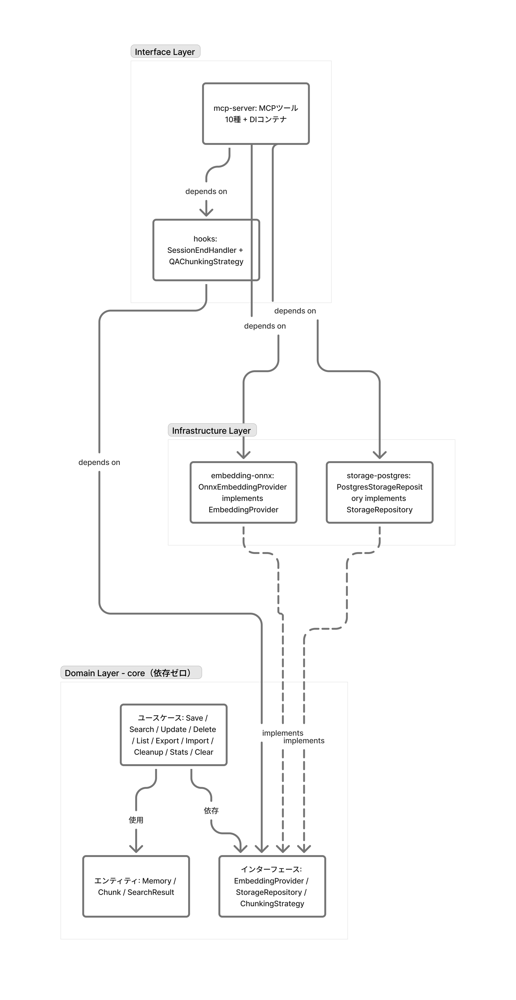

# アーキテクチャ

## クリーンアーキテクチャ



3層構造で依存方向を厳格に管理する。外側から内側にのみ依存可能。

### Domain Layer — `@claude-memory/core`

外部依存ゼロ。ビジネスロジックの中心。

**エンティティ:**
- `Memory` — 記憶の本体（id, content, embedding, metadata, timestamps）
- `Chunk` — 会話の分割単位（content, metadata）
- `SearchResult` — 検索結果（memory, score, matchType）
- `SearchFilter` — 検索フィルタ（projectPath, source, tags）

**インターフェース（型定義）:**
- `EmbeddingProvider` — `embed()`, `embedBatch()`, `getDimension()`
- `StorageRepository` — `save()`, `searchByKeyword()`, `searchByVector()`, `list()`, `delete()`, `exportAll()`, `deleteOlderThan()`, `countOlderThan()`
- `ChunkingStrategy` — `chunk()`

**ユースケース:**
- `SaveMemoryUseCase` — 保存 + 重複チェック（コサイン類似度 >= 0.95）
- `SearchMemoryUseCase` — ハイブリッド検索（pg_bigm + pgvector → RRF → 時間減衰）
- `UpdateMemoryUseCase` — 更新（content変更時のみ再embedding）
- `DeleteMemoryUseCase` — 削除（存在チェック付き）
- `ListMemoriesUseCase` — 一覧取得（ページネーション、最大100件）
- `ExportMemoryUseCase` — 全記憶をJSON形式でエクスポート
- `ImportMemoryUseCase` — JSONからインポート（embedding再計算）
- `CleanupMemoryUseCase` — 古い記憶の削除（dry-run対応）
- `GetStatsUseCase` — 統計情報取得
- `ClearMemoryUseCase` — 全記憶削除

### Infrastructure Layer

coreのインターフェースを実装する（依存性逆転の原則）。

**`@claude-memory/embedding-onnx`:**
- `OnnxEmbeddingProvider` implements `EmbeddingProvider`
- @huggingface/transformers でローカルONNX推論
- multilingual-e5-small（384次元）がデフォルト
- `embedBatch` は `Promise.all` で並列処理

**`@claude-memory/storage-postgres`:**
- `PostgresStorageRepository` implements `StorageRepository`
- Drizzle ORM + postgres パッケージ
- pgvector: HNSWインデックスによるベクトル近傍検索
- pg_bigm: GINインデックスによる日本語対応キーワード検索
- コネクションプール対応（max=10、`DB_POOL_SIZE`で設定可能）
- 検索ヒット時に `lastAccessedAt` を自動更新（クリーンアップの判定基準）

### Interface Layer

外部との接点。

**`@claude-memory/mcp-server`:**
- MCPツール10種を公開（stdio transport）
- DIコンテナ（`createContainer`）で全パッケージを組み立て・注入
- Pino loggerで構造化ログ
- 操作レイテンシをレスポンスに含む

**`@claude-memory/hooks`:**
- `SessionEndHandler` — PostSessionEndフックのエントリポイント
- `QAChunkingStrategy` implements `ChunkingStrategy` — 会話をQ&Aペアに分割（最大1000文字/チャンク、文境界で分割）

## パッケージ構成

```
packages/
├── core/              ドメイン層（依存ゼロ）
├── embedding-onnx/    ONNX埋め込み実装
├── storage-postgres/  PostgreSQL + pgvector + pg_bigm
├── mcp-server/        MCP Server + DI
└── hooks/             Claude Code Hooks連携
```

## 依存方向

```
mcp-server → embedding-onnx → core
           → storage-postgres → core
           → hooks → core
```

`dependency-cruiser` で自動検証される。違反するとCIおよびpre-commitフックで検出される。

## データベーススキーマ

```sql
CREATE TABLE memories (
  id UUID PRIMARY KEY DEFAULT gen_random_uuid(),
  content TEXT NOT NULL,
  embedding vector(384),
  session_id TEXT,
  project_path TEXT,
  tags TEXT[],
  source TEXT,                    -- 'manual' | 'auto'
  created_at TIMESTAMPTZ NOT NULL DEFAULT now(),
  updated_at TIMESTAMPTZ NOT NULL DEFAULT now(),
  last_accessed_at TIMESTAMPTZ NOT NULL DEFAULT now()
);

-- 日本語対応キーワード検索
CREATE INDEX idx_memories_bigm ON memories USING gin(content gin_bigm_ops);

-- ベクトル近傍検索
CREATE INDEX idx_memories_vector ON memories USING hnsw(embedding vector_cosine_ops);
```

## 検索アルゴリズム

### ハイブリッド検索

1. クエリをembedding化（384次元ベクトル）
2. キーワード検索（pg_bigm）とベクトル検索（pgvector）を**並列実行**
3. RRF（Reciprocal Rank Fusion, k=60）で両結果を統合
4. 時間減衰を適用: `score *= 0.5^(経過日数 / 30)`
5. スコア順で上位N件を返却

### 重複排除

保存前に最近傍1件のコサイン類似度を検査。閾値（デフォルト0.95）以上なら保存をスキップ。`Promise.all` で全チャンクを並列チェック。

## アルゴリズム詳細

### RRF（Reciprocal Rank Fusion）

異なる検索手法の結果を公平に統合する方式。各結果のスコアを順位から算出し、合算する。

```
計算式: score = 1 / (k + rank)    k=60（論文推奨の標準値）
```

k が大きいほど順位差の影響が小さくなる（結果が均等化される）。

```
例: k=60

キーワード検索: 1位=記憶A, 2位=記憶B, 3位=記憶C
ベクトル検索:   1位=記憶B, 2位=記憶D, 3位=記憶A

記憶A: keyword 1/(60+1) + vector 1/(60+3) = 0.0164 + 0.0159 = 0.0323
記憶B: keyword 1/(60+2) + vector 1/(60+1) = 0.0161 + 0.0164 = 0.0325 ← 最高スコア
記憶C: keyword 1/(60+3)                   = 0.0159
記憶D:                    vector 1/(60+2) = 0.0161

→ 結果: 記憶B > 記憶A > 記憶D > 記憶C
  （両方の検索にヒットした記憶Bが最も関連性が高いと判定）
```

### 時間減衰

古い記憶のスコアを指数関数的に下げる。半減期30日。

```
計算式: score × 0.5^(経過日数 / 30)

今日の記憶:     score × 1.0    （そのまま）
30日前の記憶:   score × 0.5    （半分）
60日前の記憶:   score × 0.25   （1/4）
90日前の記憶:   score × 0.125  （1/8）
```

これにより「3ヶ月前に保存した設計判断」より「昨日保存した最新の決定」が上位に来る。ただし完全に消えるわけではなく、他に関連記憶がなければ古い記憶も返される。

### 重複排除の仕組み（コサイン類似度）

テキストはembeddingにより384次元ベクトルに変換される。2つのベクトルの「向きの近さ」を0〜1で表したものがコサイン類似度。閾値 `0.95` 以上なら「実質同一内容」とみなし保存をスキップする。

```
計算式: cosine_similarity >= 0.95 → 重複と判定
```

セッション終了時のauto保存では複数チャンクの重複チェックを `Promise.all` で並列実行し、N+1問題を回避。

### QAチャンキング

会話をQ&Aペアに分割するチャンキング戦略。

1. 連続するuserメッセージ → Q部分
2. 連続するassistantメッセージ → A部分
3. `Q: {question}\nA: {answer}` 形式で結合
4. 最大1000文字を超えた場合は文境界で分割（`。` `.` `!` `?`）
5. 単一文が上限を超える場合は文字数で強制分割

### 埋め込みモデル

ONNX Runtimeによるローカル推論。外部APIへの依存なし。

- **モデル**: multilingual-e5-small（384次元、~100MB）
- **初期化**: 遅延初期化（初回embed時にモデルをダウンロード、`~/.cache/`にキャッシュ）
- **プーリング**: mean pooling
- **正規化**: L2 norm
- **バッチ処理**: `Promise.all` で並列実行

### インデックス戦略

| インデックス | 型 | 用途 |
|-------------|-----|------|
| idx_memories_bigm | GIN (gin_bigm_ops) | 日本語キーワード検索（pg_bigm） |
| idx_memories_vector | HNSW (vector_cosine_ops) | ベクトル近傍検索（pgvector） |

- **キーワード検索**: `LIKE '%query%'` でフィルタ → `bigm_similarity()` でスコア付け → スコア降順ソート
- **ベクトル検索**: `<=>` 演算子でコサイン距離計算 → HNSWインデックスで高速近傍検索 → スコア = 1 - distance
